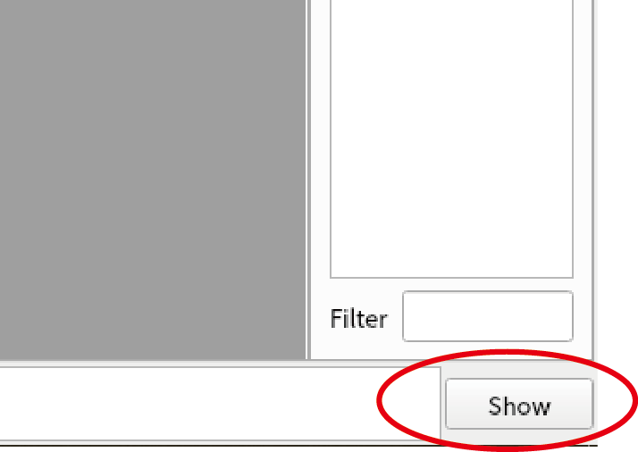
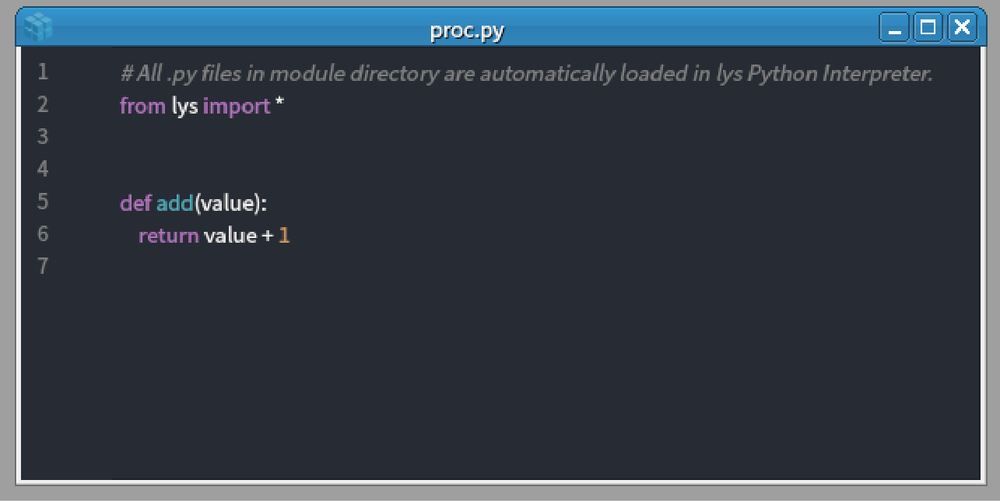
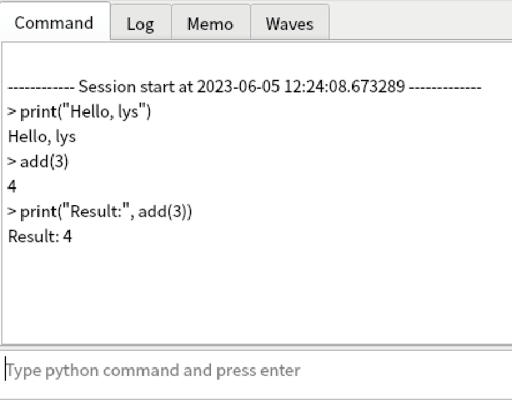

Use lys as Python interpreter
=====================================

Use Python interpreter
---------------------------

1. After staring *lys*, you see the main window.

.. image:: ./image_cui/overview.png

2. Click "Show" button at the bottom-right edge to show the command log.

3. Type the command below in the text box at the bottom::
    
    print("Hello, lys")

.. image:: ./image_cui/command.png
    :scale: 50%

4. You see the "print" command is executed as Python command.

.. image:: ./image_cui/commandResult.png
    :scale: 50%

5. It's done! You can execute all Python commands from the Python interpreter in *lys*.

Define new function
---------------------------

1. Next, let's try to define new function and execute. Press Ctrl+P to open proc.py file. 

.. image:: ./image_cui/Proc.png
    :scale: 50%

2. Define function below and Press Ctrl+S to save the contents::

    def add(value):
        return value + 1

It is saved as "./module/proc.py".

3. Type the code below to execute "add" function from the command line (You see "Result: 4")::
    
    print("Result:", add(3))

4. It's done! You can define arbitrary function and class in proc.py file. If you want to understand what is done for detail, see :doc:`shell`

Now you can do everything that Python can do in *lys*. Go to next step(:doc:`visualization`)