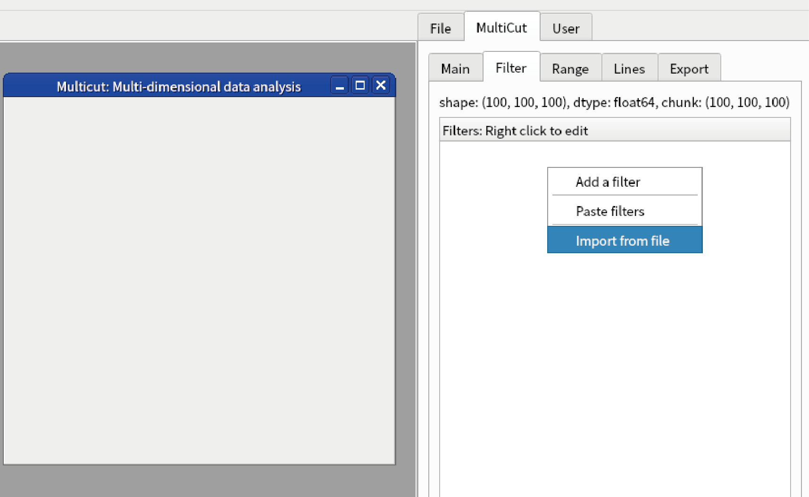
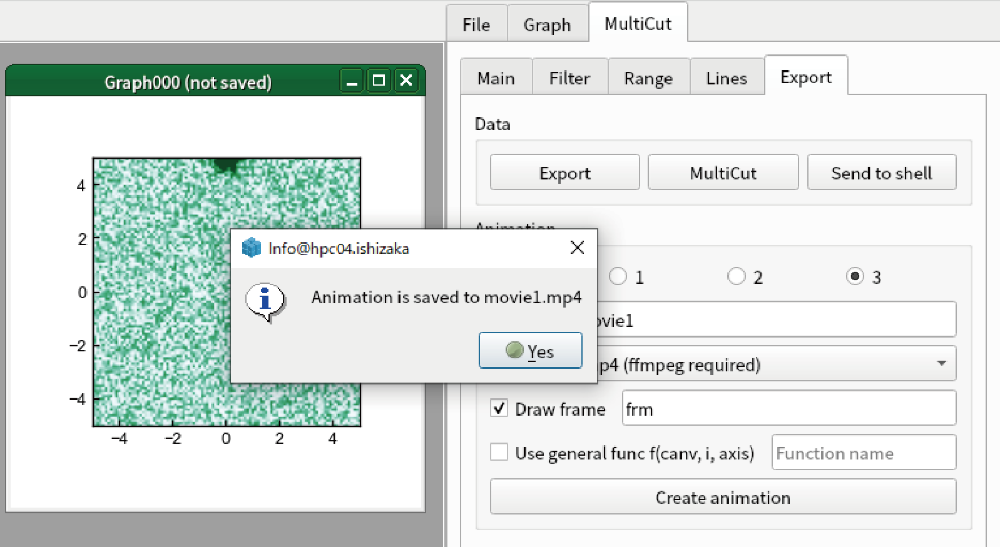

Advanced usage of MultiCut
===================================

Parallel computing
---------------------------

MultiCut uses dask for the backend, and there fore most of calculation is done in parallel when you launch *lys* with -n option.
However, there are several note to efficiently parallelize all calculations.

- To do all calculation efficiently, load data by dask (see :doc:`newLoader`). If the data loading is not paralle, it could become bottleneck.
- If you implement your own filter, take care the calculation is efficiently done (see :doc:`newFilter`).
- Several pre-defined filters may not be efficient. See diagnostics below to confirm.
- When you want to see the diagnostics of dask, go to "Help"-"Open dask status in browser" (https://docs.dask.org/en/stable/dashboard.html).
- At present, *lys* does not support distributed computing although it should work.

Import/Export filters
----------------------------

1. You can save the filters to files. Open MultiCut by the code below::

    import numpy as np
    multicut(np.random.rand(100,100,100))

2. Go to "Filters" tab, add "Median" filter in "Smoothing".

.. image:: ./image_mcut/adv5.png
    :scale: 50%

3. Right click "Filters" and select "Export to file".

.. image:: ./image_mcut/adv6.png

4. Save as "filter1.fil"

5. Right clidk "Filters" and select "Clear". All filters are cleared.

6. Right click "Filters" and select "Import from file". Select "filter1.fil". You can reproduce the Median filter.

Reproduce your analysis
----------------------------
1. MultiCut automatically save the analysis process as filters in the result. You can check what is done in MultiCut as following.

2. Start MultiCut by the code below::

    import numpy as np
    data = np.random.rand(100,100,100)
    multicut(data)

3. Apply default template (see :doc:`mcut`).

4. Right click "data2", and select "Copied"-"Export".

.. image:: ./image_mcut/adv1.png

5. Save as "data2.npz".

6. Close the MultiCut window and restart it by the code below::

    multicut(data)

7. Go to "Filter" tab in the sidebar, right click "Filters", select "Import from file".

8. Change "Files of type" to .npz and select "data2.npz"

.. image:: ./image_mcut/adv3.png

9. The filter to reproduce "data2" is loaded. Press "Apply filters" at the bottom.

10. When you see the result by applying default template for 1D data, you can confirm "data2" is reproduced.

.. image:: ./image_mcut/adv4.png

11. It is noted that the analysis results should be saved as .npz file to enable this functionarities. We recommend to save all important results to .npz file. In addition, original data is not saved because it may be very large. Do not forget which is the original data.

Creating animation
----------------------------
0. (Optional) To create an animation, we highly recommend to use ffmpeg. Install ffmpeg following the instruction in official website (https://ffmpeg.org/).

1. Open test data by the code below::

    multicut(resources.gauss_3d_data())

2. Apply default template from the sidebar.

3. It is highly recommended to create new independent graph to create animation. Right click "data1" and select "Connected"-"Display as graph"-"image".

.. image:: ./image_mcut/anim1.png

4. Confirm that the image is changed when you change the value of "axis3" from "Range" tab of "MultiCut" tab in sidebar.

5. Change the colormap of the image to "BuGn". Apply any modification you want.

.. image:: ./image_mcut/anim2.png

6. Go to "Export" tab of "MultiCut" tab in sidebar.

7. Confirm that "Frame axis" is "3". In the present case, "Axis 3" is used as animation axis.

8. Check "Draw frame", and type "frm" in the textbox at the right.

.. image:: ./image_mcut/anim3.png
    
9. (Important) Click the graph that you want to create animation. In the present case, you should click Graph000.

10. Click "Create animation". After several time (depending on the environment, it takes 20 seconds in our environment), you see a message box.

11. You see the .mp4 file is created.

.. image:: ./image_mcut/anim5.png

