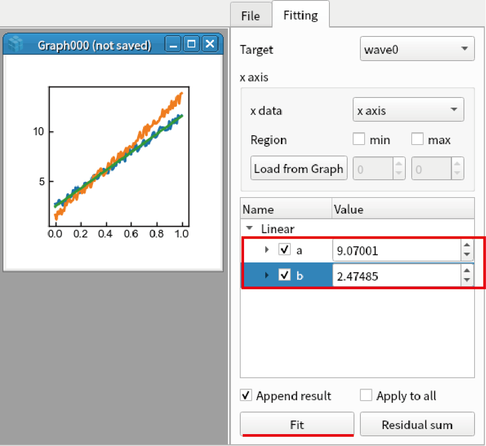
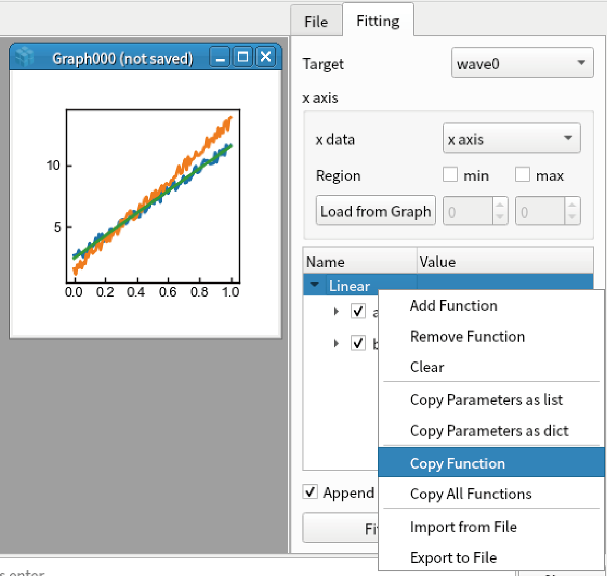
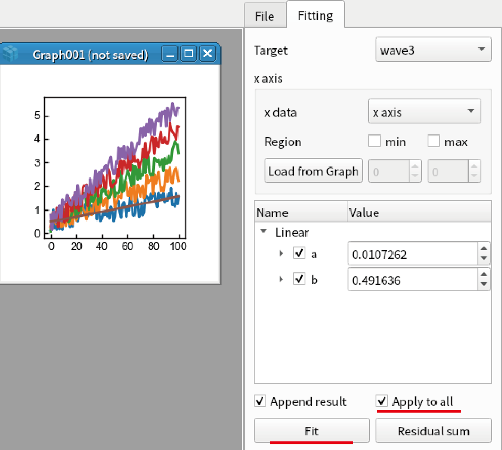
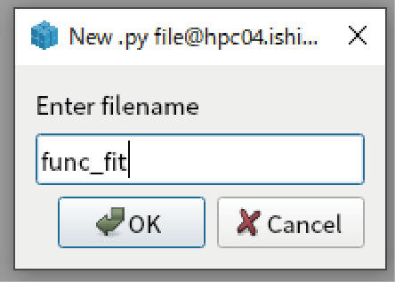
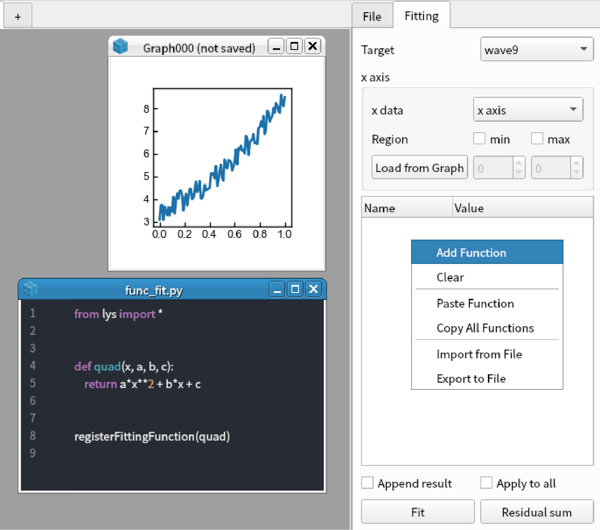

Fitting
===============

*lys* supports fitting 1D data. You can start fitting by pressing Ctrl+F on the graph including 1D data.

Fitting 1D data
------------------------
1. Create test data for fitting by the code below::

    import numpy
    x = np.linspace(0, 1, 101)
    y1 = 9 * x + 2 + np.random.rand(101)
    y2 = 12 * x + 1 + np.random.rand(101)
    display(Wave(y1, x), Wave(y2,x))

2. Press Ctrl+F on the created graph to open fitting window.

.. image:: ./image_fitting/image1.png
    :scale: 50%

3. Right click the white box and select "Add Function".

.. image:: ./image_fitting/image2.png
    :scale: 50%

4. In the dialog box, select "Linear" and click "OK" to add linear function (y = ax + b).

.. image:: ./image_fitting/image3.png
    :scale: 50%

5. Check "Append" result in the side bar. The green line is shown in the graph. Enter "5" as the "a" parameter of "Linear" function (This is initial guess).

.. image:: ./image_fitting/image4.png
    :scale: 50%

6. Click "Fit". Then fitting results are shown. It is noted that b should be around 2.5 because np.random.rand gives values between 0 to 1.

7. Right click the function (above "Linear" in the treeview) and select "Copy Function".

8. Select "wave1" in the combo box. 

9. Right click the white box and select "Paste Function".

.. image:: ./image_fitting/image7.png
    :scale: 50%

10. Fit the second data by clicking "Fit" button.

Limit fitting region
---------------------------------------------

1. Create test data for fittin by the code below::

    import numpy
    x = np.linspace(0, 1, 101)
    y = 5 * x + 1 + np.random.rand(101)
    display(Wave(y, x))

2. Press Ctrl+F to open fitting window.

3. Select region by dragging the cursor from around 0.3 to 0.8 of the horizontal axis in the graph.

.. image:: ./image_fitting/region1.png
    :scale: 50%

4. Click "Load from Graph" in "x axis" group. The region you selected is loaded in the box.

.. image:: ./image_fitting/region2.png
    :scale: 50%

5. Fit the data by linear function. Only the data between x = 0.3 to 0.8 is fitted.

.. image:: ./image_fitting/region3.png
    :scale: 50%

Parameters plot
---------------------------

1. Create sequence of data for fitting by the code below::

    import numpy
    x = np.linspace(0, 1, 101)
    ys = [a * x + np.random.rand(101) for a in [1,2,3,4,5]]
    display(*[Wave(y) for y in ys]])

2. Press Ctrl+F to open fitting window. Fit the first data by linear function.

.. image:: ./image_fitting/param1.png
    :scale: 50%

3. Check "Apply to all" and click "Fit". Click "Yes" in the two dialog box.

4. You can confirm that all curves are fitted by linear function by changing the item in the "Target" box.

.. image:: ./image_fitting/param3.png
    :scale: 50%

5. Right click "a" parameter in "Linear" function and select "Plot this parameter".

.. image:: ./image_fitting/param4.png
    :scale: 50%

6. Fitting result ("a") for all five data is shown as a graph.

.. image:: ./image_fitting/param5.png
    :scale: 50%

Add new function
------------------------

1. You can define your original function for fitting. Select "Python"-"Create new .py file" in the main menu.

.. image:: ./image_fitting/newFunc1.png
    :scale: 50%

2. Enter arbitrary name for the file (Here we use "func_fit").

3. Define new function by pasting the code below::

    from lys import *

    def quad(x, a, b, c):
        return a*x**2 + b*x + c

    registerFittingFunction(quad)
    
4. Save the .py file by pressing Ctrl+S

5. Make a test data by calling the code below from the command line::

    import numpy as np
    x = np.linspace(0,1,101)
    y = 3*x**2 + 2*x + 3 + np.random.rand(101)
    display(Wave(y,x))

6. Open fitting function by pressing Ctrl+F.

7. Select "Add Function" by right clicking the white box in the sidebar.

8. You can find "quad" function in the dialog box. Select "quad".

9. Click "Fit" button. You can fit the data by quadratic function.

.. image:: ./image_fitting/newFunc4.png
    :scale: 50%