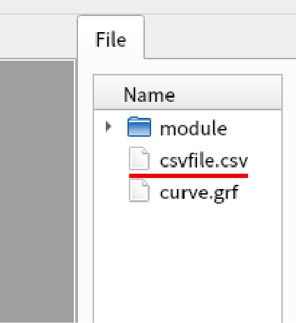
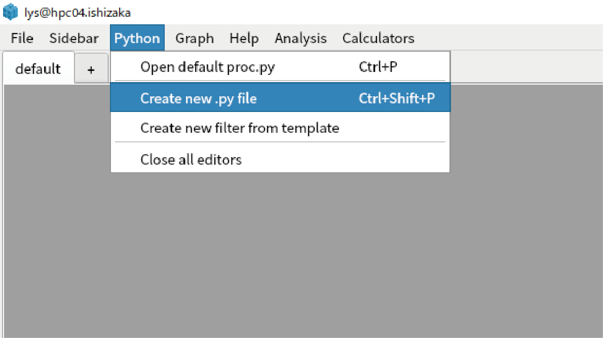
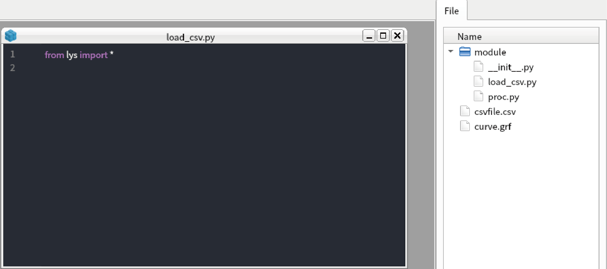

Loading your file
===============================

Although *lys* enables you to easily analyze and visualize multi-dimensional data, usually you should load your experimental/calculated data from file.

Here I show how your data should be imported into *lys* although it is strongly dependent on your file type. Several examples of loading file is found in :doc:`load_examples`

Loading csv file
---------------------------

1. The easiest file type to load is .csv file, which is a sequence of float divided by conmmas.

2. Create csv file for test by entering the code in the command line in *lys*::

    resources.load_csv()

3. Confirm that "csvfile.csv" is created in fileview.

4. Click "Python" in main menu, select "create new.py file".

5. Enter "load_csv" in the file name.

.. image:: ./image_loader/image3.png
    :scale: 50%

6. New .py file is created in "module/load_csv.py".

7. Type the code below in "load_csv.py". The "load_csv" function simply load csv file and return Wave object::

    from lys import *
    import numpy as np

    def load_csv(path):
        data = np.loadtxt(path, delimiter=",")
        return Wave(data)
    
    registerFileLoader(".csv", load_csv)

.. image:: ./image_loader/image5.png
    :scale: 50%

8. Once the function is registerd by "registerFileLoader" function, you can load the file by "load" function. Type the code below in the command line in *lys*::

    w = load("csvfile.csv")
    display(w)

9. You see the csv file is successfully loaded and displayed. You can also load .csv file by right clicking "csvfile.csv" in the fileview and select "Load".

.. image:: ./image_loader/image6.png
    :scale: 50%

Loading data by dask
---------------------------------

Sometimes you have many files to load. If the shape of data in each file is identical, you can load these file by parallel using dask.delayed.

The code below is simple example that generate data using dask.delayed. You can copy and paste to new .py file in *lys*::

    from lys import *
    from dask import delayed
    import dask.array as da
    import numpy as np

    def load_file_dummy():
        # load file here, in this exapmle, we return random value.
        return np.random.rand(100)

    def load_parallel():
        data = [delayed(load_file_dummy)() for _ in range(100)]
        array = [da.from_delayed(d, shape=(100,), dtype=float) for d in data]
        array = da.vstack(array)
        return DaskWave(array)

Such parallel load of data has a great advantage when it is used with MultiCut. As the MultiCut use dask.array for data processing, you can do all calculation in parallel by simply passing the DaskWave object to MultiCut::

    dw = load_parallel()
    multicut(dw)  

No complex code is needed for parallel processing except in the data loading. For the further generation of dask.array, see dask website (https://docs.dask.org/en/latest/).