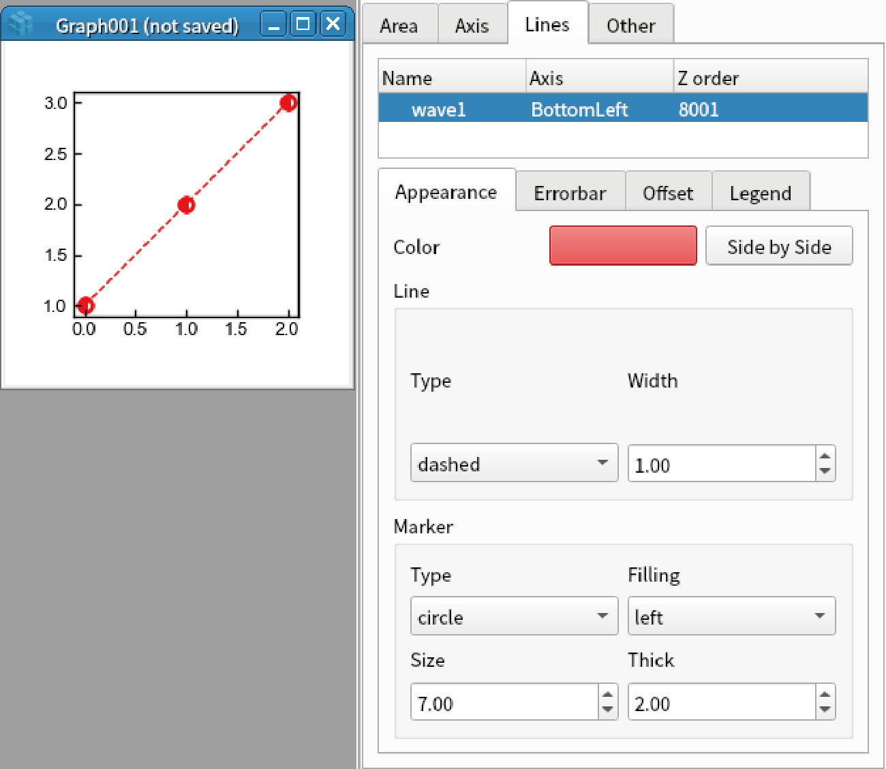
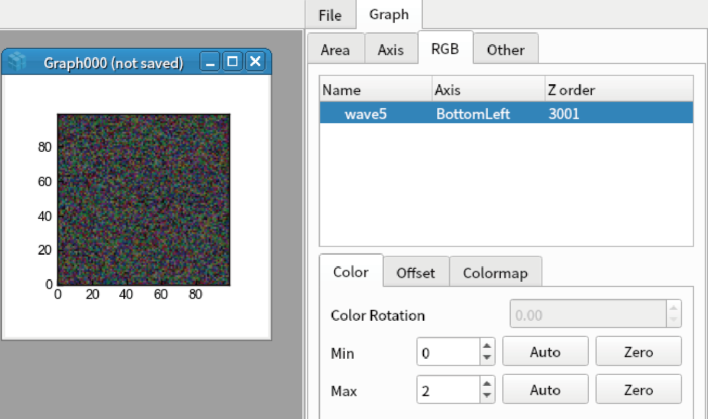
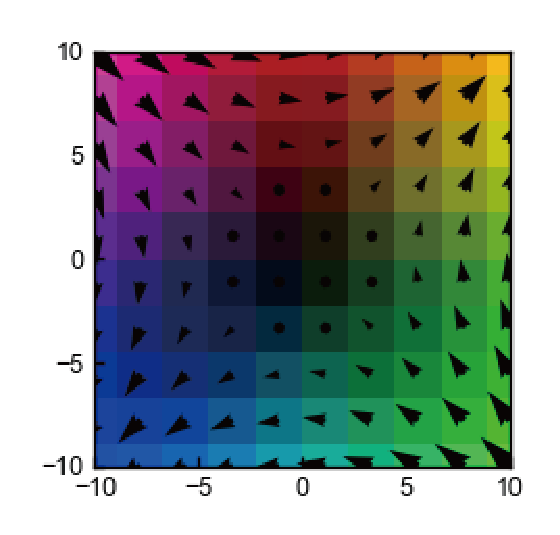

Displaying various data types
====================================

Line
---------------

1. Display 1D data by the command below::
    
    display([1,2,3])

2. Double click the graph to open graph setting in the sidebar and go to "Lines" tab.

3. Select the first data.

.. image:: ./image_variousData/image1.png

4. Set the parameters below.

- Color: Red
- Line Type: dashed
- Line Width: 1
- Marker Type: Circle
- Marker Filling: left
- Marker Size: 7
- Marker Thick: 2

5. Go to "Errorbar" tab, set the parameters below.

- Cap size: 4
- y error Type: Const
- y error Value: 0.2

.. image:: ./image_variousData/image3.png

6. Go to "Offset" tab, set the parameters below. Note that the vertical and horizontal axes are changed.

- x offset: 1
- x muloffset: 0.5
- y offset: 2
- y muloffset: 0 (Auto) 

.. image:: ./image_variousData/image4.png

7. Go to "Legend" tab, set the parameters below.

- Show legent: checked
- Position x: 0.35
- Position y: 0.7

.. image:: ./image_variousData/image5.png

8. Right click the first data, and select "Hide". After you confirm the data is hidden, select "Show". 

.. image:: ./image_variousData/image6.png

9. Right click the first data, and select "Raw Data"-"Display". A new graph is displayed.

10. Right click the first data, and select "Processed Data"-"Display". A new graph is displayed. Note that vertical and horizontal axes are changed.

11. Right click the graph, and select "Duplicate as"-"Matplotlib". The graph is duplicated.

.. image:: ./image_variousData/image7.png
    :scale: 50%

Image
-----------------

1. Display 2D data by the code below::

    import numpy as np
    x = y = np.linspace(-10,10,100)
    data = np.random.rand(100,100)
    display(Wave(data, x, y))

2. Double click the graph to open graph setting.

3. Go to "Images" tab, select the first data.

.. image:: ./image_variousData/img1.png

4. Set the parameters below.

- Gam: 1.2
- Rev: checked
- Colormap: terrain
- Min: 0
- Max: 2

.. image:: ./image_variousData/img2.png

5. Go to "Offset" tab, set the parameters below. Note that the vertical and horizontal axes are changed.

- x offset: 2
- y offset: 1

.. image:: ./image_variousData/img3.png

6. Goto "Colorbar" tab, set the parameters below.

- Show colorbar: checked
- Length: 0.5

.. image:: ./image_variousData/img4.png

RGB image
-------------------------
1. An image of shape (n, m, 3) is treated as RGB image. Display RGB image by the code below::

    display(np.random.rand(100,100,3))

2. Double click the image to open graph setting, go to "RGB" tab, and select the first data.

- Min: 0
- Max: 2

3. Go to "Colormap" tab, and check "Show colormap".

.. image:: ./image_variousData/rgb3.png

Vector field
--------------------------
1. An image of shape (n, m, 2) is treated as vector field. Display vector field by the code below. Note that it is hard to see if there are too many points (like 100*100)::

    display(np.random.rand(10,10,2))

2. Double click the image to open graph setting, go to "Vector" tab, and select the first data.

3. Set the parameters below.

- Pivot: middle
- color: Red
- scale: 11
- width: 1.5

.. image:: ./image_variousData/vector1.png

Complex image
--------------------------
1. Complex image A(x,y) can be converted to vector field whose x component is real(A) and y component is imag(A). Such vector fields can be converted to colomap via color wheel.

2. Make 2D complex image and display colormap and vector field by the code below::

    import numpy as np
    x = y = np.linspace(-10,10, 10)
    xx, yy = np.meshgrid(x,y)
    A = xx + yy*1j
    display(Wave(A,x,y))
    append(Wave(A,x,y), vector=True) # vector=True is needed to show the complex image as vector

Contour
----------------
1. You can add contour by the code below. However, contour map is under test. We do not recomment the general users to use this function::

    display(np.random.rand(100,100), contour=True)