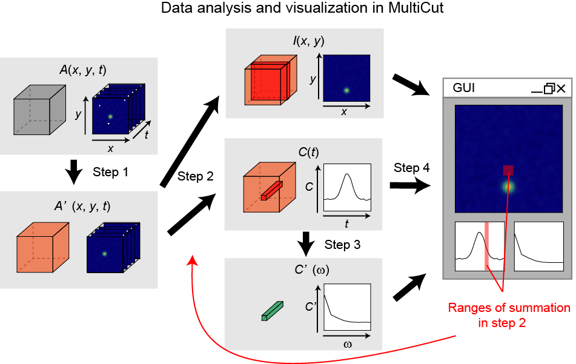

# Summary

`lys` is a Python-based multi-dimensional data analysis and visualization platform based on several popular libraries such as `numpy`, `dask`, `matplotlib`, and `Qt`. It provides  graphical user interfaces (GUI) to intuitively and flexibly manipulate data array and graphics. In particular, multidimensional ($\ge$ 3D) data can be easily analyzed and visualized via optimized GUI interface, `MultiCut`. All the processes in `MultiCut` are automatically calculated in parallel using `dask` arrays, providing fast data analysis on high-performance computers (HPCs). These GUIs in `lys` offer interactive and low-code data analysis for users not familiar with the application programming interfaces (APIs) of the scientific Python ecosystems. In addition to the user-friendly GUIs, `lys` also provides flexibility for experts through its character user interface (CUI). Arbitrary Python code can be executed in the extended Python interpreter system, which can be integrated into `MultiCut`. The hybrid GUI/CUI architecture in `lys` enables an intuitive, low-code, parallel, flexible, and extensible multi-dimensional data analysis for a broad range of users. 

# Statement of need

Data analysis and visualization are indispensable parts of scientific research. Understanding the experimental and simulated data deeply is essential for extracting complex phenomena behind them. To this end, intuitive and fast analysis/visualization is highly required. There are  several well-known softwares that focus on analysis and visualization, such as Igor Pro (WaveMetrics) and Matlab (MathWorks) as well as the domain-specific softwares in respective fiels. Although they have been utilized for scientific research for a long time, recent progress in experimental/computational methods change the situation. The data sizes obtained from the experiments/calculations are acceleratedly increased within this decades, reaching more than terabytes in many fields. In addition, sophisticated analysis methods for such a huge data has also been matured. As a result, general analysis ecosystem maintained by the large scientific open source community has an advantage in the state-of-the-art analysis as compared to the proprietary/domain-specific softwares. Python and related scientific libraries are one of the most popular analysis/visualization environment at the moment. In the scientific Python ecosystem, flexible and fast analysis of numerical arrays has been done by several popular libraries such as `numpy`[@harris2020array], `scipy`[@2020SciPy-NMeth], `dask`[@rocklin2015dask] combined with visualization tools such as `matplotlib`[@Hunter:2007], `pyqtgraph`[@pyqtgraph] and `Mayavi`[@ramachandran2011mayavi]. Utilizing these variety of libraries, sophisticated data analysis/visualization tools such as `data-slicer` [@Kramer2021] and `napari`[@chiu_clack_2022] have been developed. Development of `Jupyter Notebook` [@Kluyver2016jupyter] and related libraries further enhance the capability of interactive data analysis. However, most of these libraries require users to be familiar with low-level application programming interfaces (APIs), which prevents intuitive analysis and visualization. In particular, when the analyzed data is a more than 3-dimensional array, even simple interactive visualization usually requires Python code of tens of lines. Such on-demand analysis and visualization programs should be modified (and tested) when the data change, although a very similar process is frequently applied to data with different dimensions. Furthermore, the code for such an analysis should be preserved to guarantee the reproducibility of scientific results.

The multi-dimensional data analysis and visualization platform, `lys`, offers a graphical user interface (GUI) for intuitive analysis and visualization of multi-dimensional arrays. It employs `dask` as a backend, which can be used for easy parallel calculations on high-performance clusters (HPCs). Publication-quality and fast data visualizations are provided by matplotlib and pyqtgraph, respectively. `lys` is a low-code system where most analysis and visualization processes can be done from the GUI without any knowledge of respective libraries. In particular, a tool for interactive and fast analysis of multi-dimensional array is realized, by which all analysis processes can be exported as a single file for reproducibility. In contrast to such a user-friendly GUI, `lys` can be easily extended because it employs a hybrid CUI/GUI architecture. Users can edit and run their own Python code in `lys` to extend the functionalities of `lys`. 

The philosophy of `lys` is to be a general platform of data analysis and visualization (not to be a simple image viewer/analysis program) that targets on research scientists who want to minimize efforts for these processes. All of processes from loading data to generating publication-quality figure can be done in `lys`. In addition, these processes (including user-defined Python code) are stored in single directory and can be used to reproduce the results. The rich features of `lys` significantly compress the time for analysis/visualization of multi-dimensional array. 

# Overview

`lys` is a hybrid GUI/CUI platform oriented towards the multi-dimensional data analysis. Figure 1 shows main features of `lys`. Arbitrary Python commands can be executed from integrated Python shell (#1). User-defined Python scripts can be edited by the internal editor (#2) and can be executed. Matplotlib graphs that contain curves, images, vector fields, and RGB images can be displayed (#3) and edited via GUI in sidebar (#4). 

`MultiCut` is a central tool in `lys`, which enables intuitive, low-code, parallel, flexible, and extensible analysis for multi-dimensional arrays. In the following, the data analysis and visualization processes are explained, using three-dimensional movie data $A(x_i,y_j,t_k)$ as an example ($i,j,k$ represent indices of the array). The data analysis in `MultiCut` is done in four steps. First, the original $N$-dimensional data $A$ is modified by preprocess as $A' = P(A)$, where $P$ is an arbitrary function that translates $N$ dimensional data to $M$ dimensional data. In the example case in Fig. 2, impulsive noise in the original data is removed using $3 \times 3 \times 3$ median filter: 

$$A'(x_i,y_j,t_k) = \mathcal{M}[A(x_i,y_j,t_k)],$$

where $P = \mathcal{M}$ represents median filter to remove the noise. Since the median filter does not change the dimension of data, $N=3$ equals $M$ in this case. The preprocess is used for heavy analysis that requires whole $N$-dimensional data. Second, MultiCut generates an arbitrary number of 2-dimensional images and 1-dimensional curves from $M$-dimensional $A'$ by taking a summation along arbitrary axes. In the example case in Fig. 2, an image $I(x_i,y_j)$ and a curve $C(t_k)$ is generated as:

$$
\begin{aligned}
I(x_i,y_j) &= \sum_{t_k}A'(x_i,y_j,t_k), \\
C(t_k) &= \sum_{x_i, y_i}A'(x_i,y_j,t_k).
\end{aligned}
$$

The range of the summation is specified from the GUI as described later. These images and curves are used for visualization in step 4. Third, each image and curve can be individually modified by postprocessing. In Fig. 2, Fourier transformation along time axis $\mathcal{F}_t$ is applied to time-dependent image intensity $C(t_k)$:

$$
C'(\omega_l) = \mathcal{F}_t[C(t_k)].
$$

Different from preprocessing (step 1), postprocessing function access only an image or a curve. In addition, the postprocessing should be executed within short time (< 0.1 s) because it is repeatedly called whenever the summation range in step 2 is changed. Finally, these analyzed data are displayed in a GUI, where users can modify the ranges of the summation interactively. Once the summation range from step 2 is changed, the postprocess is recalculated and the result is automatically updated. Such four-step calculation enables flexible analysis of multi-dimensional data. In the above example, spectrum of the image intensity $C'(\omega_l)$ within the user-specified image region can be interactively analyzed and displayed while the time-consuming median filter is done only once in step 1. It should be noted that a multi-dimensional array of arbitrary dimensions can be analyzed and visualized by `MultiCut` although the given example is for a 3-dimensional case. Constructing such interactive analysis system is a hard task in conventional Python systems. Once the interactive analysis system is set up using MultiCut, the settings for the analysis can be exported as a file and reused. This guarantees the scientific reproducibility of the data analysis, which can be verified by other scientists. In addition, all of the processes in `lys` are implemented using `dask` array, and therefore all calculations can be performed in parallel when they are done on HPC systems.

In addition to the features described above, `lys` provides some basic analysis such as data fitting and array editor GUIs. Combining these functionalities of `lys` offers intuitive, low-code, fast, and flexible analysis to users not familiar with Python while preserving the expansion capability for experts.

As compared to other analysis/visualization softwares, `lys` has several advantages. First, it employs Python (`numpy`/`dask`) as a backend and therefore variety of scientific computing libraries such as `scipy` can be used. This cannot be achieved by similar softwares such as `Igor Pro` and `Matlab`. Second, `lys` is an open source software. Users can confirm what is done in the software and modify it, which cannot be realized in proprietary softwares. Third, `lys` offers interactive GUIs represented by `MultiCut`, which lacks in the scientific Python ecosystems so far.  Fourth, `lys` can treat massive multi-dimensional array more than hundreds of gigabites through `dask`. Coexistence of intuitive GUI and fast parallel calculation is very limited in other similar software/libraries so far. Finally, `lys` is a general platform for data analysis and visualization. All of processes from loading data to generating publication-quality figure can be done in `lys`. It is noted that `data-slicer` and `napari` offers similar and interactive data manipulation, they are data inspection and visualization softwares rather than the general platform for research scientists.

# Projects using the software

As `lys` is a general-purpose multi-dimensional data analysis system, it has been used in many works within the last five years, particularly for our experiments and simulations. Simple visualization functionalities are used for the analysis of movies obtained by ultrafast electron diffraction and microscopy [@APEX2018;@NanoLett2020]. A pre-release version of MultiCut was used for analyzing propagation of nanometric acoustic waves [@NanoLett2023] and magnetic-texture dynamics [@SciAdv2021]. Analyzing massive five-dimensional data sets obtained by five-dimensional scanning transmission electron microscopy [@Faraday2022;@RSI2023;@JMicro2023] was also achieved using parallel calculations on an HPC, demonstrating the scalability of `lys`. It was also used for the postprocessing of  finite-element simulation results [@StrDyn2021].

# Acknowledgements

We acknowledge contributions from Yusuke Chiashi, Jumpei Koga, Dongxue Han and comments from Takahiro Shimojima and Kyoko Ishizaka. This  work  was  partially  supported  by  a Grant-in-Aid  for  Scientific  Research  (KAKENHI)  (Grant  No.  21K14488). 

# References